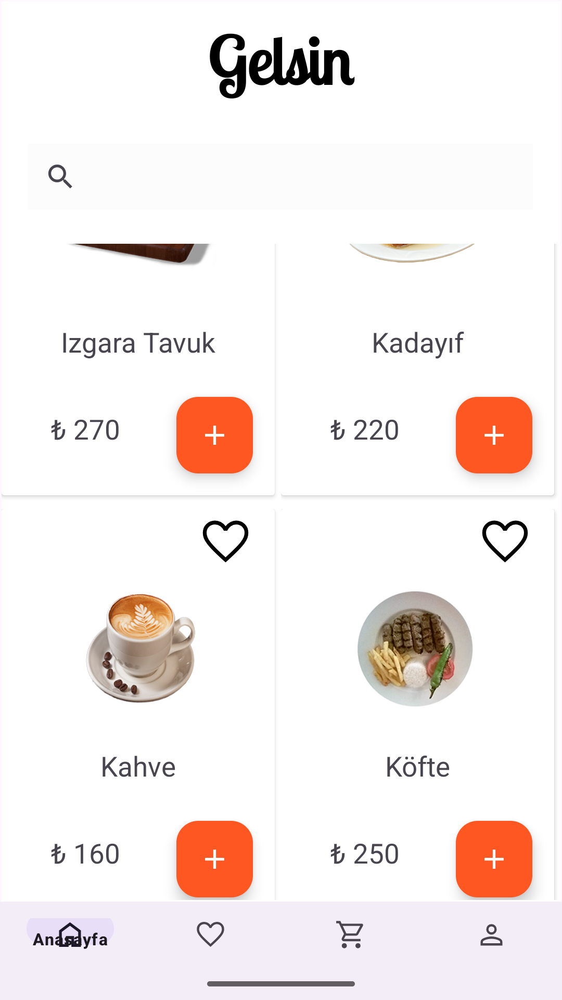
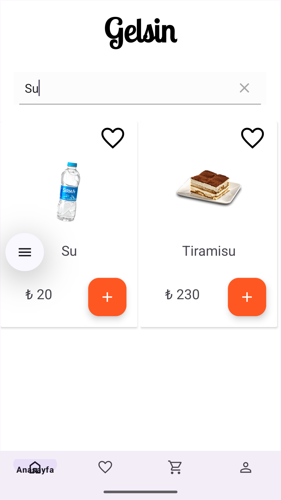
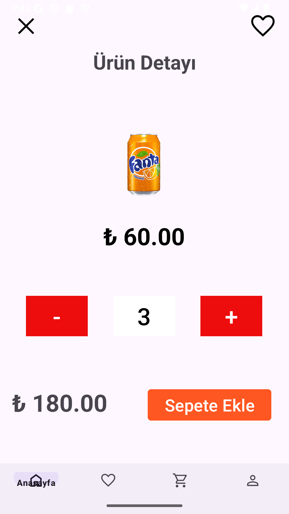
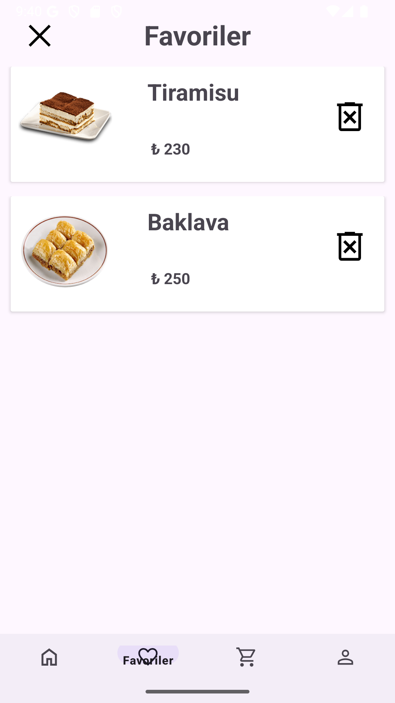
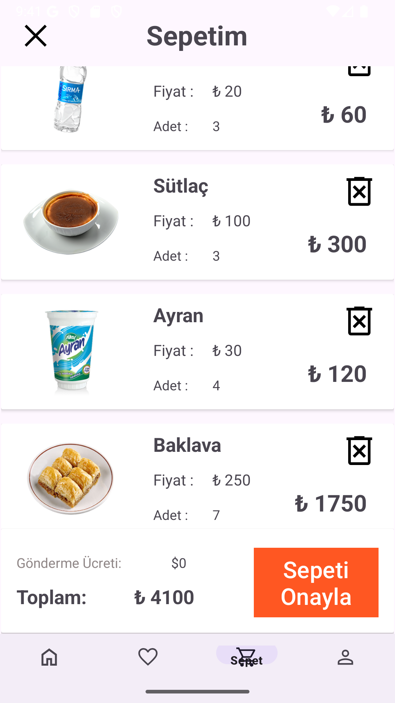

# 🍽️ Food Ordering App

A modern food ordering application built using **Kotlin** for Android. This project provides a clean, fast, and intuitive user experience for browsing meals, adding favorites, and placing orders.

---

## 🚀 Technologies Used

| Technology       | Description                                                                 |
|------------------|-----------------------------------------------------------------------------|
| **MVVM**         | Clean architecture separating business logic from UI                        |
| **Room Database**| Local data storage (favorites, cart, etc.)                                  |
| **Retrofit**     | Networking library to communicate with RESTful APIs                         |
| **Hilt**         | Dependency injection to manage class instances                              |
| **LiveData**     | Observes data changes and updates UI reactively                             |
| **ViewModel**    | Manages UI-related data in a lifecycle-aware way                            |
| **Coroutines**   | Asynchronous operations like networking and database                        |
| **ViewBinding**  | Type-safe access to UI components                                            |

---

## 📱 Features

- 🔐 Firebase Authentication (Login/Register)
- 🍽️ Browse meals and view details
- 🔍 Search meals by name
- ❤️ Add/remove meals from favorites
- 🛒 Add/remove meals to cart
- 📦 Place and review orders
- 🌓 Light & Dark theme support (optional)

---

## 🖼️ Screenshots

### 🏠 Home Screen

### 🔍 Search Screen

### 📋 Detail Screen

### ❤️ Favorites

### 🛒 Cart

---
